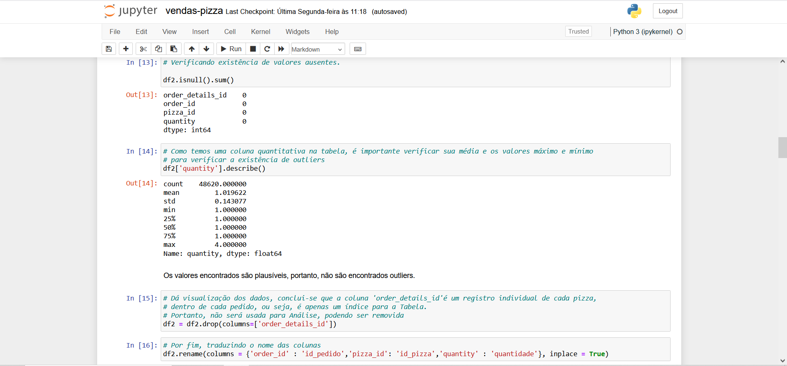

# 🍕 Projeto: Análise de Vendas - Pizzaria (Python/Excel)
Este projeto simula a atuação de um analista de dados em uma pizzaria fictícia, com foco na extração de insights a partir do histórico de pedidos. Utilizei Python para limpeza e manipulação dos dados e Excel para visualização dos principais indicadores de vendas.

---

# 📌 Visão Geral

- **Ferramentas utilizadas**: Python (pandas, openpyxl), Microsoft Excel
- **Foco**: Faturamento, performance por tipo/tamanho de pizza, horários de pico
- **Produto final**: Dashboard em Excel

 ---

## 📚 Dicionário de Dados (resumo)
Este projeto usa 5 tabelas principais:

- **Pedidos**: dados de pedidos, data, hora e quantidade de pizzas.
- **Detalhes_Pedido**: informações sobre as pizzas presentes em cada pedido.
- **Pizzas**: informações gerais sobre as pizzas (tamanho, preço, etc).
- **Tipos_Pizzas**: informações específicas sobre cada pizza + tradução do nome.
- **Vendas**: junção das tabelas para analisar as vendas.

Para o dicionário completo, veja [aqui](./entrega/dicionario_pizzaria.txt).

## 🧼 Etapas do Projeto

### 1. Tratamento de Dados (Python)
- Correção de colunas
- Junção de tabelas com `merge`
- Conversão de tipos
- Cálculo de colunas auxiliares (faturamento por pizza, horário etc.)

📄 Script: [`scripts/limpeza_dados_pizzaria.py`](./scripts/vendas-pizza.ipynb)

### 2. Análise e Dashboard (Excel)
- Tabelas dinâmicas e funções (PROCV,SOMASE,etc)
- Gráficos de linha, barras e pizza
- KPIs com caixas e ícones
- Formatação condicional

📊 Dashboard: [`entregas/dashboard_final.xlsx`](./entrega/Projeto_Final_Pizzaria.xlsx)

---

## 📷 Preview do Dashboard

---

## 🎯 Insights Obtidos

- **R$ 1.635.720,10** em faturamento total
- Maior volume de pedidos entre **12h e 13h** e **17h e 18h**
- Tamanhos mais vendidos: **M e G**
- Pizzas mais vendidas: **Frango com Churrasco, Pepperoni e Havaiana**
- Pizzas com melhor faturamento: **Pizza de Frango Tailandesa**
- **Brie Carré** foi a menos vendida e teve menor faturamento por pedido
- Recomendação de **promoção para Soppressata** e **remoção da Brie Carré**

---

## 🔗 Sobre o Dataset
Dataset original: Pizza Sales – Maven Analytics  
Disponível em: [https://www.mavenanalytics.io/data-playground](https://www.mavenanalytics.io/data-playground)
