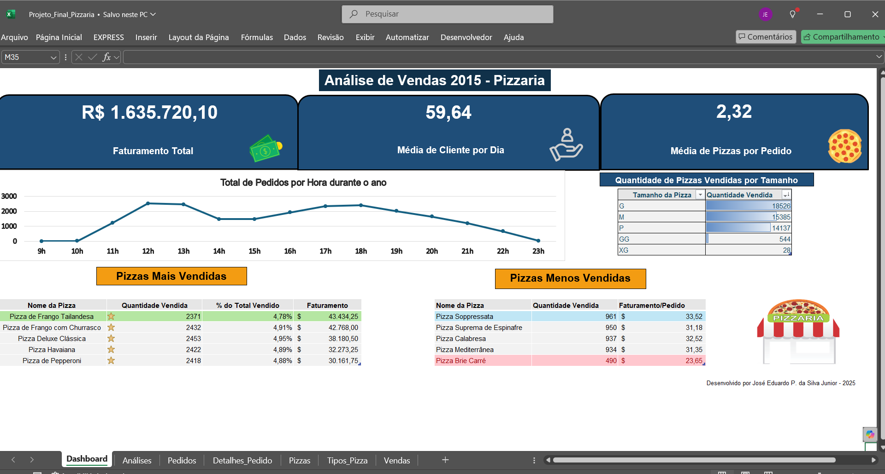

# 🍕 Projeto: Análise de Vendas - Pizzaria (Python/Excel)
Projeto de análise de vendas de uma pizzaria fictícia baseado em dados fornecidos pela Maven Analytics. O objetivo foi extrair insights relevantes a partir de um processo completo de tratamento, análise e visualização de dados, utilizando Python e Microsoft Excel.

---

# 📌 Visão Geral

- **Ferramentas utilizadas**: Python (pandas, openpyxl), Microsoft Excel
- **Foco**: Faturamento, performance por tipo/tamanho de pizza, horários de pico
- **Produto final**: Dashboard em Excel

 ---

## 📑 Dicionário de Dados

| Tabela          | Campo              | Descrição                                                                                                                                            |
| --------------- | ------------------ | ---------------------------------------------------------------------------------------------------------------------------------------------------- |
| `orders`        | `order_id`         | Identificador único para cada pedido feito por uma mesa.                                                                                             |
| `orders`        | `date`             | Data em que o pedido foi realizado (inserido no sistema antes do preparo e do serviço).                                                              |
| `orders`        | `time`             | Hora em que o pedido foi realizado (inserido no sistema antes do preparo e do serviço).                                                              |
| `order_details` | `order_details_id` | Identificador único para cada pizza registrada dentro de um pedido (pizzas iguais aparecem na mesma linha com aumento na quantidade).                |
| `order_details` | `order_id`         | Chave estrangeira que relaciona os detalhes do pedido com o pedido em si.                                                                            |
| `order_details` | `pizza_id`         | Chave estrangeira que liga a pizza aos seus detalhes (como tamanho e preço).                                                                         |
| `order_details` | `quantity`         | Quantidade de cada pizza de mesmo tipo e tamanho pedida no mesmo pedido.                                                                             |
| `pizzas`        | `pizza_id`         | Identificador único para cada pizza (definido por tipo + tamanho).                                                                                   |
| `pizzas`        | `pizza_type_id`    | Chave estrangeira que relaciona a pizza ao seu tipo geral.                                                                                           |
| `pizzas`        | `size`             | Tamanho da pizza (Small, Medium, Large, X Large, ou XX Large).                                                                                       |
| `pizzas`        | `price`            | Preço da pizza em dólares (USD).                                                                                                                     |
| `pizza_types`   | `pizza_type_id`    | Identificador único para cada tipo de pizza.                                                                                                         |
| `pizza_types`   | `name`             | Nome da pizza como mostrado no cardápio.                                                                                                             |
| `pizza_types`   | `category`         | Categoria do cardápio à qual a pizza pertence (Classic, Chicken, Supreme ou Veggie).                                                                 |
| `pizza_types`   | `ingredients`      | Ingredientes separados por vírgula conforme o cardápio. Todas incluem queijo mussarela, mesmo que não mencionado, e molho de tomate, salvo exceções. |

## 🧼 Etapas do Projeto

### 1. Tratamento de Dados (Python)
- Correção de colunas
- Junção de tabelas com `merge`
- Conversão de tipos
- Cálculo de colunas auxiliares (faturamento por pizza, horário etc.)

📄 Script: [`scripts/limpeza_dados_pizzaria.py`](./scripts/vendas-pizza.ipynb)

### 2. Análise e Dashboard (Excel)
- Tabelas dinâmicas e funções (PROCV,SOMASE,etc)
- Gráficos de linha, barras e pizza
- KPIs com caixas e ícones
- Formatação condicional

📊 Dashboard: [`entregas/dashboard_final.xlsx`](./entrega/Projeto_Final_Pizzaria.xlsx)

---

## 📷 Preview do Dashboard

---

## 🎯 Insights Obtidos

- **R$ 1.635.720,10** em faturamento total
- Maior volume de pedidos entre **12h e 13h** e **17h e 18h**
- Tamanhos mais vendidos: **M e G**
- Pizzas mais vendidas: **Frango com Churrasco, Pepperoni e Havaiana**
- Pizzas com melhor faturamento: **Pizza de Frango Tailandesa**
- **Brie Carré** foi a menos vendida e teve menor faturamento por pedido
- Recomendação de **promoção para Soppressata** e **remoção da Brie Carré**

---

## 🔗 Sobre o Dataset
Dataset original: Pizza Sales – Maven Analytics  
Disponível em: [https://www.mavenanalytics.io/data-playground](https://www.mavenanalytics.io/data-playground)
